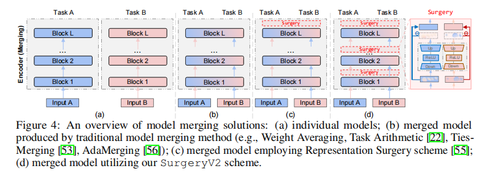

# Surgery V2
A repository of **'[SurgeryV2: Bridging the Gap Between Model Merging and Multi-Task Learning with Deep Representation Surgery]()'**.


## Abstract
>

<center>

</center>

## Citation
If you find our paper or this resource helpful, please consider cite:
```
@article{SurgeryV2_Arxiv_2024,
  title={SurgeryV2: Bridging the Gap Between Model Merging and Multi-Task Learning with Deep Representation Surgery},
  author={Yang, Enneng and Shen, Li and Wang, Zhenyi and Guo, Guibing and Wang, Xingwei and Cao, Xiaochun and Zhang, Jie and Tao, Dacheng},
  journal={arXiv preprint arXiv:},
  year={2024}
}

@article{RepresentationSurgery_ICML_2024,
  title={Representation Surgery for Multi-Task Model Merging},
  author={Yang, Enneng and Shen, Li and Wang, Zhenyi and Guo, Guibing and Chen, Xiaojun and Wang, Xingwei and Tao, Dacheng},
  journal={Forty-first International Conference on Machine Learning},
  year={2024}
}
```
Thanks!

## Datasets
Refer to dataset processing in the [task_vectors](https://github.com/mlfoundations/task_vectors).

Or you can download the processed data from [Baidu Cloud disk](https://pan.baidu.com/s/1w0Z2UVv3NVmqDhjH8WTOJQ?pwd=kvg6).


## Task Vectors / Checkpoints

You can download the fine-tuned checkpoints from the [task_vectors#checkpoints](https://github.com/mlfoundations/task_vectors#checkpoints).
The Google Drive folder is: [task_vectors_checkpoints](https://drive.google.com/drive/folders/1u_Tva6x0p6oxu5Eo0ZZsf-520Cc_3MKw)


*Note: When using ```torch.load(xxx_checkpoint).state_dict()``` fails, you can try ```pickle.load(open(xxx_checkpoint, 'rb')).state_dict()```.*


## Train

- Model Merging Methods (e.g., Weight Averaging, Task Arithmetic, Ties-Merging, AdaMerging)
```
python src/main_tv.py
```

- Model Merging Methods with [Surgery](https://arxiv.org/pdf/2402.02705) (e.g., Weight Averaging w/ Surgery, Task Arithmetic w/ Surgery, Ties-Merging w/ Surgery, AdaMerging w/ Surgery)

```
python src/main_tv_surgery_v1.py
```

- Model Merging Methods with our [SurgeryV2](https://arxiv.org/pdf/) (e.g., Weight Averaging w/ Surgery V2, Task Arithmetic w/ Surgery V2, Ties-Merging w/ Surgery V2, AdaMerging w/ Surgery V2)
```
python src/main_tv_surgery_v2.py
```

*Note: Due to machine memory limitations, our implementation reloaded the dataset at each step, which resulted in a significant amount of additional time. If your machine has enough memory, you can load all the data before optimizing the surgery module, which will speed up the training significantly.*


## Acknowledgement
Our implementation references the code below, thanks to them.

- Representation Surgery: https://github.com/EnnengYang/RepresentationSurgery

- AdaMerging: https://github.com/EnnengYang/AdaMerging

- Task Arithmetic: https://github.com/mlfoundations/task_vectors

- TIES-MERGING: https://github.com/prateeky2806/ties-merging/tree/main

- Model Soups: https://github.com/mlfoundations/model-soups

- Tent: https://github.com/DequanWang/tent
